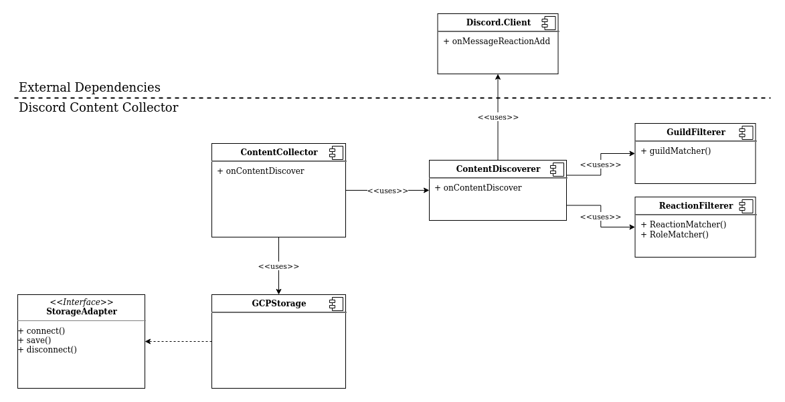

# Discord Content Collector

This project stores filtered messages into content repository that can be used
for static builder tools.

## Configuration

### Using `config.json` file

Place a file to your app root directory having contents as following example:

    {
      "token": "cskh3g2kghi2sdf32.ak3sge.3uhgk3g.sjjfkew",
      "guilds": [
        {
          "guild": "Your Clan Discord",
          "filter": {
            "reaction": {
              "👌": {
                "roles": ["moderators"]
              },
              "custom-emoji-lol": {
                "roles": ["admins"]
              }
            }
          }
        }
      ]
    }

## Main Features

* It filters Discord messages based on configuration
* TODO: It stores content

## Plan

## License

This software is licensed under [GPL 3.0 or later](./LICENSE.txt).
